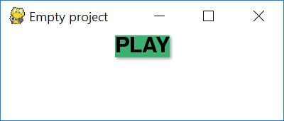

# Pygame GUI 2

## Aim

Pygame is a great and simple way to create basic windowed applications. 
It is therfore a privilieged entry point for python learners to get out of the console.
However, people often ask for GUI features in pygame: _"How can I have a simple button ?"_ or _"How can the user enter their name ?"_. 

The goal of this librairy is to answer all those questions and provide the easiest possible interface to create, update, control and manipulate what we will call widgets. (Buttons, TextBoxes, Sliders, Switches...)

### Our principles

- KISS: Keep it sweet and simple
- Simple and ugly are not synonyms
- Simple can be powerfull
- Simple should be customisable
- No code is better than ugly code

## Instalation

    git clone https://gitlab.com/lama-corp/graphalama
    cd graphalama
    python setup.py install -U

## How to use

Most simple pygame applications look like this

    import pygame
    pygame.init()

    # Setup of variables, objects...
    stop = False
    screen = pygame.display.get((400, 400))

    # Main loop
    while not stop:

        for event in pygame.event.get():
            if event.type == pygame.QUIT:
                stop = True
            else:
                # Handle inputs, if the user click on some clickable places, buttons...
                # Handle the keys pressed to move players, input text...
                # It's the logic of the game that depends of inputs

        # Then you have an internal logic, applying gravity, running AIs, anything that changes itself

        # And finally you render everything with some more or less advanced technics

        screen.fill((255, 255, 255))

For any widget you need to have at least 3 parts in the code to implement it: creation, handling the input, and rendering it. Some widget can have an internal logic going like clock or timer but we'll come back on that later.

Say you want to add a button in your window. A big green play button. We reduce each step to the minimun.

- Creation :
      `play_button = Button("PLAY", bg_color=GREEN, function=play)`
- Input handling (clicks):
        `play_button.update(event)`
- Rendering: `play_button.render(screen)`

## Customisation

Before knowing how to cutomise your widgets so they match your style, we have to understand what is a widget.
A widget is made of three things:
 - a **Shadow**: optional, it provides a nice depth to our application and accentuate our widgets
 - a **Shape**: defines the shape of the background. It also defines the borders, the size and where you can click/select the widget. To list a few common: Rectangle, Circle, RoundedRect... 
 - a **content**: the information of the widget, it can be the widget's own content or a child widget (did you know that we can put any widget inside a Button ?)
 
Those three layers are mixed together to create the widget. To customise our widgets we can therefore easily change one of those three layers.

### Custom Shape
Let's start again with our play button: `Button("PLAY", bg_color=GREEN, function=play)`.
The default shape is a `Rectangle`, So that's what it would look like:

But you're not limited to rectangles, you can have a rounded rectangle, a circle or any custom shape (we'll come back on creating your custom shapes later)

### Custom content

### Custom shadow
